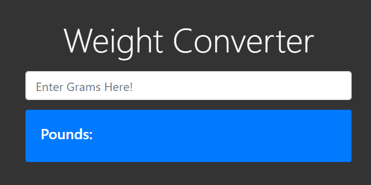

### This is a simple html page that to convert grams to pounds.

## Briefly introduction: 
Reference: https://www.calculatorful.com/grams-to-pounds

The Gram, also gramme, symbol “g”, is a unit of mass or weight in the metric system. Originally one gram was defined as equal to the mass of one cubic centimeter of pure water at 4 °C (39.2 °F) or a milliliter of pure water

Pound, or avoirdupois pound (standard symbols: lb), is a unit of mass or weight in the UK imperial systems or the US customary systems of measurement. One pound equals 0.45359237 kilograms as legally defined in the international avoirdupois system or 16 avoirdupois ounces

## Relationship between grams and ounces
To convert [grams to pounds](https://www.calculatorful.com/grams-to-pounds), you just need to remember 
```
Pounds = grams x 0.002205
```

## The html page

Create a html file with the content
```
<!DOCTYPE html>
<html lang="en">
<head>
  <meta charset="UTF-8">
  <meta name="viewport" content="width=device-width, initial-scale=1.0">
  <meta http-equiv="X-UA-Compatible" content="ie=edge">
  <link rel="stylesheet" href="https://stackpath.bootstrapcdn.com/bootstrap/4.3.1/css/bootstrap.min.css">
    <style>
      body {
        margin-top:50px;
        background-color: #333;
        color:#fff;
      }
      form {
        margin-top:20px;
      }

    </style>
  <title>Unit Converter</title>
</head>
<body>
  <div class="container mx-auto">
    <div class="row">
      <div class="col-md-6 mx-auto">
        <h1 class="display-4 text-center">Weight Converter</h1>
        <form>
          <div class="form-group">
            <input id="grsInput" type="number" class="form-control form-control-lg" placeholder="Enter Grams Here!">
          </div>
        </form>
        <div id="output">

          <div class="card bg-primary mb-2 p-4">
            <div class="card-block">
              <h4>Pounds:</h4>
              <div id="poundsOutput">
              </div>
            </div>
          </div>
        </div>
      </div>
    </div>
  </div>

  <script>
    document.getElementById('grsInput').addEventListener('input', function(e){
      let grs = e.target.value
      document.getElementById('poundsOutput').innerHTML = grs * 0.002205;
    })
  </script>
</body>
</html>
```
The output:


